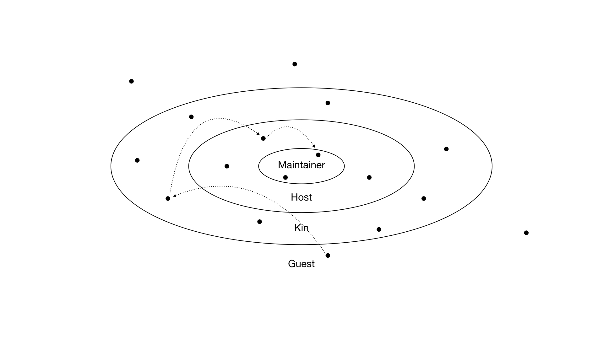

# 3. open organisation



We operate with an inclusive, opt-in engagement model. It is a contribution based [meritocracy](https://en.m.wikipedia.org/wiki/Meritocracy):

"**Meritocracy** \(merit, from Latin mereō, and -cracy, from Ancient Greek κράτος kratos 'strength, power'\) is a political philosophy that holds that certain things, such as economic goods or power, should be vested in individuals on the basis of talent, effort, and achievement, rather than factors such as sexuality, race, gender, age, or wealth. Advancement in such a system is based on performance, as measured through examination or demonstrated achievement."

## Process & Roles

| Guest | Kin | Host | Maintainer |
| :--- | :--- | :--- | :--- |
| You, as a reader of this document, are a guest. You watch, read, listen to, or use something that the guild made. This work is made for you, and supported by you. If you feel you are receiving something valuable and would like to express your gratitude, you can support us via patreon.com/dirty\_work and by joining the conversation. | If you're invited or apply to contribute to a project in a significant way. Now you have a say in all decision making.   | If you, as a Kin, propose your own project, and it's accepted by the majority of all other Kin.  | If you start to engage on the protocol level of the guild |

